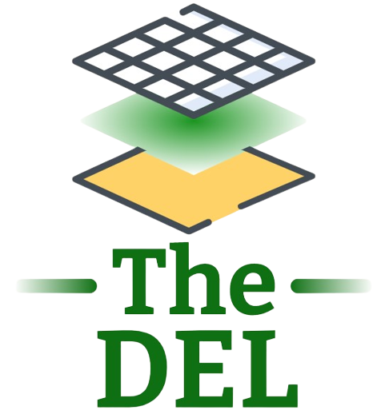

# The DEL 

## Overview

Digital Engineering Licensing - Now is a good time to think about using technology to modernize the engineering seal.

## Details

One possible use case for the digital engineering license would be in the licensing process. The digital engineering license would be a digital record of an engineer’s work portfolio, making it easier to apply for licenses in multiple jurisdictions. Right now, engineers must make a separate application using the same information in every state they want to be licensed. The engineer has to interact with each state licensing agency not just to acquire but also maintain their licenses. A digital engineering license would be issued once. Details about which states the engineer is licensed in would be associated with the license and accessible to other engineers within the system. When an engineer wants to become licensed in another state, they would authorize access to their work records and personal information to the licensing agency for approval. Because the records are consistent, the engineer can apply to multiple agencies at the same time. This would simplify the process for engineers who need to become licensed quickly for work.

One way to make this work would be to create an NFT that is unique to each engineer. The issuing organization would be the smart contract that maintains the engineer’s record. Every instance where the engineer seals a project would be added to the record as a newly minted NFT. So, the engineer's work portfolio would be a set of NFTs containing meta data for the engineering design that they sealed. As they do more work, their portfolio grows, and people with access to the system can view their experience. The work record would always be current since the NFT updates with each use.

Would you as an engineer use a tool like this?

## Roadmap

Stay Tuned...

## Contact

@YellowBird
@flexfinrtp